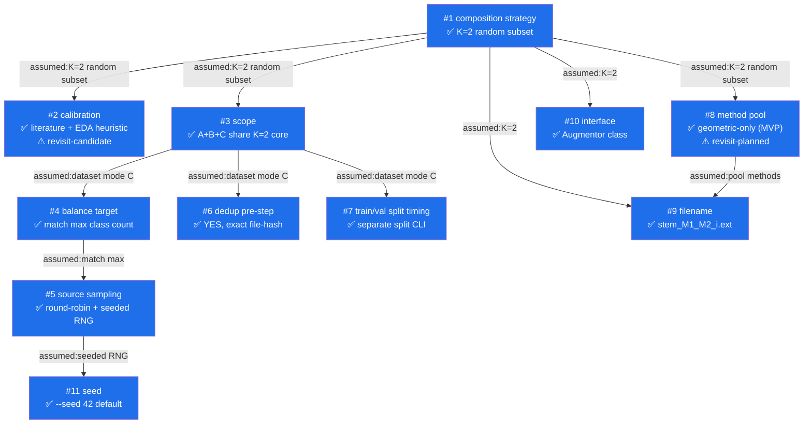

# Decision Graph — Augmentor Pipeline Design

**Topic**: Design the augmentor pipeline (orchestration layer above per-image augmentation methods).
**Context**: Leaffliction (42 RNCP). EDA findings from issue #4 → 6× class imbalance, B1 color = signal, B2 shape not signal, B3 features scattered, B4 top-down only.
**Started**: 2026-06-09
**Parent**: Forked from learn-mentor session on `docs/learning/leaffliction-augmentation.md` (S5 pipeline stage).

---

## Nodes

### #1 — Composition strategy: how many transforms per output image?
- **Status**: resolved
- **Adopted**: **b — K=2 random subset (RandAugment-lite).** Each output image gets exactly 2 transforms randomly drawn from the pool, each at its calibrated "safe" magnitude.
- **Rejected**:
  - **a** (1 transform per output) — subject Part 2 already does this via existing `Augmentation.py`; dataset-level repetition of single-perturbation images doesn't expose the model to real-world compound conditions (e.g., a tilted photo taken in dim light is BOTH rotated AND darkened).
  - **c** (stack all N) — B1 (color is signal) cannot survive 6-layer compounding without hue/structure mangling beyond recognition; geometric+photometric+erasure stacked would likely push the leaf out of the class manifold.
  - **d** (mixed: some 1, some many) — adds complexity (which images get how many?) without a clear win over (b).
- **Key premise**: EDA constraints — B1 sets the hue/color tolerance ceiling; safety hinges on the calibrated per-method magnitude (see #2).

---

### #2 — Calibration strategy: how to set the per-method "safe magnitude"?
- **Status**: resolved (marked **revisit-candidate** — see Open Risks)
- **Adopted**: **d — literature + EDA heuristic.** Take RandAugment / Albumentations default ranges, then tighten per EDA group:
  - High freedom (B2 shape not signal): `flip / rotate / shear / skew / crop` → literature defaults.
  - Low freedom (B1 color = signal): `hue / saturation` → tightest end of literature range.
  - Forbidden (B3 features scattered): large-area erasure → outright reject or cap area < 10%.
- **Rejected**:
  - **a** (manual human scan only) — slow, subjective; calibrating each method alone doesn't catch compounding effects under K=2.
  - **b** (full K=2 stress test) — O(N²) human review work; overkill before training; can be added later if needed.
  - **c** (classifier-feedback loop) — chicken-and-egg (need a trained baseline first); risk of overfitting calibration to a single baseline classifier's biases.
  - **e** (d + sampled b stress test) — recommended but rejected for simplicity; user pragmatic preference: lean on EDA-driven heuristics first.
- **Premise it depends on**: #1 = K=2 composition. If composition strategy changes (e.g., back to single transform), magnitude bounds can loosen.

### #3 — Scope: at what input level does the augmentor operate?
- **Status**: resolved
- **Adopted**: **D — A+B+C sharing one K=2 core.** Three CLI entry points all wrap the same `Augmentor.apply(image) → image` core:
  - **A** single-image CLI (replaces current `Augmentation.py` 6-fixed-output behavior with `--n` K=2 outputs).
  - **B** single class folder (`aug-class apple_rust/ --target 1640`).
  - **C** dataset root (`aug-dataset data/raw/Apple/ --balance` → all classes up to max).
- **Rejected**:
  - **A only** — kills B/C, can't balance 6× imbalance.
  - **B only** — works but requires manual loop per class.
  - **C only** — loses demo / debugging capability needed for subject Part 2.
- **Premise**: builds on #1 (K=2 composition is the shared core).
- **Refactor cost**: existing `Augmentation.py` switches from "6 fixed outputs, one per method" to "N outputs, each = K=2 random transforms". The current `METHODS` list in `visualization.py` stays for the interactive viewer.

### #8 — Method pool composition
- **Status**: resolved (marked **revisit-planned** — see Open Risks)
- **Adopted**: **A — current 6 geometric methods only.** Pool = `[flip, rotate, shear, skew, crop, radial_distortion]`. MVP-first to unblock teammates working on Part 4 training.
- **Rejected**:
  - **B** (6 + color_jitter) — natural target state but blocked on S3 implementation; chosen as the planned upgrade path.
  - **C** (6 + color_jitter + erasure) — erasure unsafe under B3 (features scattered); even small-area erasure risks removing disease evidence.
  - **D** (configurable pool flag) — over-engineered for current needs.
- **Premise**: builds on #1 (K=2 pool needs methods to draw from); pragmatic ship-MVP override of the ideal pool.
- **Upgrade path**: when S3 ships (`apply_color_jitter` with EDA-calibrated bounds), append to `POOL` registry. K=2 combinations grow from `C(6,2)=15` → `C(7,2)=21`.

### #9 — Output filename convention
- **Status**: resolved
- **Adopted**: **`<stem>_<Method1>_<Method2>_<i>.<ext>`** where `<i>` is the per-source augmentation index. Methods listed in call-order so the filename preserves execution sequence.
- **Example**: `apple_rust_001_Rotate_Shear_0.jpg`, `apple_rust_001_Flip_Crop_1.jpg`.
- **Rejected**:
  - `<stem>_aug_<i>.<ext>` — index-only, debugging harder ("which methods produced this artifact?").
  - `<stem>_<Method>.<ext>` (subject Part 2 style) — doesn't fit K=2 (two methods).
- **Premise**: builds on #1 (K=2 composition needs two-method encoding) and #8 (method names from pool).

### #10 — Augmentor interface
- **Status**: resolved (default chosen, low-stakes)
- **Adopted**: **class-based** — `Augmentor(pool, seed).apply(image) → image`. Holds state (RNG, pool, magnitude ranges).
- **Rejected**: pure functional `apply_random(image, pool, rng)` — stateless but parameter-heavy at call sites.
- **Premise**: implementation detail, derived from #1 + #8.

### #11 — Seed handling
- **Status**: resolved (default chosen)
- **Adopted**: **CLI `--seed 42` default; `None` means stochastic.** Default 42 keeps MVP runs reproducible; teammates can override.
- **Premise**: builds on #5 (round-robin needs seeded RNG).

### Open Risks
- **#2 is revisit-candidate**: if model training reveals overfitting / underfitting tied to augmentation magnitude, upgrade path is `d → e` (sample-based K=2 stress test on hue/saturation/erasure axes).
- **#8 is revisit-planned**: MVP ships with geometric-only pool; planned upgrade to include `color_jitter` once S3 (photometric stage) is implemented. Until then, model has no resilience to test-time lighting variation.

---

### #4 — Balance target: how to define "balanced" per class?
- **Status**: resolved
- **Adopted**: **a — match max class count.** All classes augmented up to `max(class_counts)`. Majority class untouched (no synthetic copies of `apple_healthy`).
- **Rejected**:
  - **b** (configurable target N) — N < max requires throwing away real data (forbidden); N > max augments majority with no clear benefit.
  - **c** (per-class multiplier) — doesn't solve the relative-ratio problem; still 6× imbalanced after multiplication.
  - **d** (a + opt-in majority aug) — explicitly NOT doing this; baseline simplicity. Reopen only if training shows majority class underfits.
- **Premise**: builds on #3 mode C (dataset-root balancing).
- **Implication**: `apple_rust` needs `1640 - 275 = 1365` synthetic copies from 275 sources → ~5x augment-to-real ratio. Connects to **#2 revisit-candidate** — if magnitudes are too loose, 5× synthetic dominance could pollute the rust class.

---

### #5 — Source sampling: how many K=2 outputs per source image?
- **Status**: resolved
- **Adopted**: **β — round-robin (deterministic floor + remainder) with seeded RNG.** Each source produces `floor(need / N_sources)` copies; the first `need % N_sources` sources produce one extra.
- **Rejected**:
  - **α** (random with replacement) — high variance in per-source use count; some sources may be ignored entirely.
  - **γ** (shuffle cycles) — equivalent fairness to β but order randomization adds no value (per-output variety already comes from K=2 method choice + magnitude sampling).
  - **δ** (stratified by attribute) — requires attribute labels (lighting / angle); out of scope for baseline.
- **Premise**: builds on #4 (match-max target) — needs deterministic mapping from `need` to per-source count.

### #6 — Dedup pre-processing
- **Status**: resolved (sub-detail noted for later)
- **Adopted**: **YES — dedup as pre-step before any augmentation.** Run before `#5` source sampling, so duplicate sources don't inflate the count and don't get augmented twice.
- **Sub-detail (not grilled, default chosen)**: **exact-match file hash (SHA-256 or MD5 on bytes)** — EDA issue #4 listed 7 pairs in `apple_healthy/`, all identifiable by direct comparison. If perceptual / near-duplicate detection turns out to be needed, reopen as `#6b`.
- **Rejected**: no dedup — keeping known duplicates means their augmented copies inherit the dup; effectively 2x-weight the same source through the pipeline.
- **Premise**: standalone EDA finding (C2). Does not depend on prior nodes; sits at the pre-processing layer above the balancing pipeline.

---

### #7 — Train/val split timing
- **Status**: resolved
- **Adopted**: **IV — split is a separate CLI (`split`); augmentor only operates on `train/`.** Pipeline:
  ```
  split data/raw/Apple/ --val 0.2     → data/train/, data/val/
  aug-dataset data/train/ --balance   → data/train/ filled to max class
  ```
- **Rejected**:
  - **I** (augment-all then split) — DATA LEAK: augmented copies of the same source can land in both splits.
  - **II** (split then augment train, monolithic) — correct but couples concerns.
  - **III** (augmentor handles split internally via `--val 0.2`) — convenient one-liner but implicit; risk of re-splitting on every re-run breaks val-set stability across experiments.
- **Premise**: builds on #3 (mode C dataset-level).
- **Open sub-detail**: split strategy (stratified per-class vs random) — default stratified (ML common sense), not grilled. Reopen as `#7b` if needed.

---

## Edges

- `#1 --assumed:K=2 random subset--> #2`
- `#1 --assumed:K=2 random subset--> #3`
- `#3 --assumed:dataset mode C--> #4`
- `#4 --assumed:match max class count--> #5`
- `#3 --assumed:dataset mode C--> #6`
- `#3 --assumed:dataset mode C--> #7`
- `#1 --assumed:K=2 random subset--> #8`
- `#1 --assumed:K=2 random subset--> #9` (filename encodes 2 methods)
- `#8 --assumed:method names from pool--> #9`
- `#1 --assumed:K=2 random subset--> #10`
- `#5 --assumed:seeded RNG--> #11`

---

## Diagram


