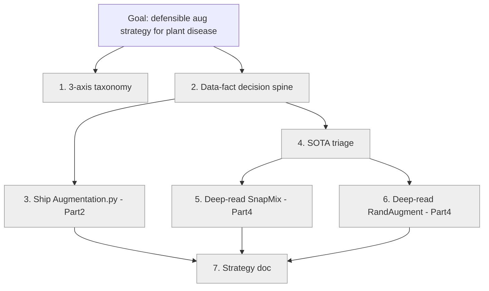

# Learning Map — Leaffliction: Augmentation Strategy for Plant Disease Detection

> Knowledge record. The core is **per-method knowledge**: why each augmentation
> method is suitable / not suitable for *this* plant-disease dataset, with the
> supporting literature. The learning-process scaffolding (stages, mastery) is
> kept at the end. **English full text first, 中文全文在後。**

---

# ENGLISH

## 1. Goal
Be able to **design and defend a layered data-augmentation strategy for a plant
disease detection dataset**, grounded in the dataset's real characteristics — not
just recite traditional transforms — arguing for each method its **mechanism,
why it is (un)suitable here, and its risk to labels/distribution**.

**One-line ability:** "Given a plant-disease dataset, I can derive an augmentation
policy from its data facts, justify every include/exclude against the literature,
and read any new augmentation paper to triage its relevance."

## 2. Acceptance
- **(a) PRIMARY — a defensible strategy document** (rubric in §6).
- **(b) CO-EQUAL — paper-reading literacy**: read a primary paper, decode its
  math, restate the mechanism as pseudo-code.
- NOT the goal: implementation handsiness, measured accuracy gains.

## 3. Dataset facts (evidence base, from Issue #4)
These are the *premises* every method decision must cite.
- **A3** smallest class = 275 images → NOT scarce. **A4** imbalance ~6x
  (apple_healthy 1640 vs apple_rust 275).
- **B1** COLOR is the main disease cue (brown spot vs green) — central constraint.
- **B2** shape/contour NOT the main cue; missing-parts only ~10% (apple_black_rot).
- **B3** lesions scattered across the leaf, ~10% of surface (not one tiny spot).
- **B4** consistent top-down shooting angle (no canonical orientation).
- **B5** low lighting variation (indoor, one light); slight brightness diff;
  some over-exposed areas / shadows (zolfagharipour note).
- **B6** occlusion NOT common.
- **C1** all images 256x256. **C2** 7 duplicate pairs exist. **C3** classes
  human-distinguishable.

## 4. The 3-axis taxonomy
| Axis | one end | other end |
|------|---------|-----------|
| unit | per-sample (1→1) | batch (mix ≥2) |
| label | label-preserving | label-mixing (soft labels) |
| timing | offline (savable file) | online (dataloader only) |

## 5. METHOD KNOWLEDGE (the core)

### 5.1 Geometric (flip / rotate / shear / skew / crop)
- **Mechanism:** remap output pixel coords to source via an affine 2x3 matrix
  (rotate/shear/skew), an axis mirror (flip), or a slice + resize (crop).
- **Axes:** per-sample · label-preserving · savable → **Part 2**.
- **Why SUITABLE here:** B4 top-down with no canonical orientation → any rotation/
  flip is a *realistic* view, so labels stay valid. Geometric ops do not touch
  color, so the B1 disease cue is preserved. C1 fixed 256x256 is easy to maintain
  (crop then resize back).
- **Why NOT / risks:** extreme crop can remove lesion evidence (B3 lesions cover
  ~10%, scattered → keep crop moderate); large shear/skew makes unrealistic leaf
  shapes; watch border/fill artifacts after rotation.
- **Verdict:** USE — core of Augmentation.py.
- **Refs:** Krizhevsky et al. 2012 (AlexNet, flips+crops); Shorten &
  Khoshgoftaar, "A survey on Image Data Augmentation for Deep Learning",
  J. Big Data 2019.

### 5.2 Color / photometric (brightness, contrast, HSV) — BOUNDED
- **Mechanism:** per-pixel intensity / channel transform (no geometry change).
- **Axes:** per-sample · label-preserving · savable → **Part 2**.
- **Why SUITABLE:** B5 slight brightness variation + over-exposure/shadow →
  mild brightness/contrast jitter improves robustness to lighting.
- **Why NOT / risks:** B1 color is the MAIN disease cue → large hue/saturation
  shifts can erase or fake the lesion signal (brown↔green). MUST bound tightly;
  prefer brightness/contrast over hue/saturation.
- **Verdict:** USE but STRICTLY BOUNDED.
- **Refs:** Szegedy et al. 2015 (color jitter); survey above.

### 5.3 Random Erasing / Cutout / GridMask
- **Mechanism:** zero-out or random-fill a region (rectangle; GridMask = grid).
- **Axes:** per-sample · label-preserving · savable → **Part 2**.
- **Why SUITABLE:** generic regularizer; forces the model not to over-rely on one
  leaf region (helps fine-grained discrimination).
- **Why NOT / risks:** B6 occlusion=NO and B2 missing-parts only ~10% → the
  "simulate occlusion" justification is WEAK for this dataset. B3 lesions are only
  ~10% of surface → a large erase can delete the only disease evidence. If used:
  small region, low probability.
- **Verdict:** CONDITIONAL (small + low-p only).
- **Refs:** DeVries & Taylor, "Cutout", 2017 (arXiv:1708.04552); Zhong et al.,
  "Random Erasing", AAAI 2020 (arXiv:1708.04896); Chen et al., "GridMask", 2020
  (arXiv:2001.04086).

### 5.4 Mixup
- **Mechanism:** pixel-wise convex combination of two images by λ; label = the
  same λ-weighted mix of the two one-hot labels.
- **Axes:** batch(2) · label-mixing · NOT savable → **Part 4**.
- **Why SUITABLE:** strong regularizer; improves calibration.
- **Why NOT / risks:** global blending AVERAGES the colors of two leaves →
  muddies the exact B1 color cue that separates diseases; for localized, color-
  based cues a global blend is worse than a patch-based method.
- **Verdict:** REJECT (in favor of CutMix/SnapMix).
- **Refs:** Zhang et al., "mixup", ICLR 2018 (arXiv:1710.09412).

### 5.5 CutMix (baseline for the deep-read)
- **Mechanism:** paste a rectangular patch of image B into A; the soft label is
  weighted by the patch AREA fraction.
- **Axes:** batch(2) · label-mixing · NOT savable → **Part 4**.
- **Why SUITABLE:** keeps local pixel statistics intact (no color averaging) →
  preserves the color cue; "localizable features" help fine-grained-ish tasks.
- **Why NOT / risks:** area-proportional label is WRONG when the pasted patch
  lands on a non-discriminative region (e.g. background) — the label claims X%
  content that isn't there. This label-noise is exactly what SnapMix fixes.
- **Verdict:** BASELINE — understood via the SnapMix deep-read.
- **Refs:** Yun et al., "CutMix", ICCV 2019 (arXiv:1905.04899).

### 5.6 SnapMix — DEEP-READ #1
- **Mechanism (summary):** use a CAM (class activation map) to weight the soft
  label by the actual *discriminative content* of the mixed regions, not by raw
  area. `[deep mechanism + exact label formula to fill after reading]`
- **Axes:** batch(2) · label-mixing (CAM-weighted) · NOT savable → **Part 4**.
- **Why SUITABLE:** designed for FINE-GRAINED data (Early vs Late Blight differ
  subtly) → removes CutMix's label-noise; respects where the disease cue actually
  is. Highest decision-relevance among mixing methods for plant disease.
- **Why NOT / risks:** needs a (pre)trained network to produce CAMs; more complex
  pipeline. `[full risk analysis to fill after reading]`
- **Verdict:** DEEP-READ (drags in CutMix + Mixup as baselines).
- **Refs:** Huang et al., "SnapMix: Semantically Proportional Mixing for
  Augmenting Fine-grained Data", AAAI 2021 (arXiv:2012.04846).

### 5.7 RandAugment — DEEP-READ #2
- **Mechanism (summary):** sample N operations from a fixed set, each applied at a
  single global magnitude M; only 2 hyperparameters (N, M).
  `[search-space reasoning + op list to fill after reading]`
- **Axes:** per-sample policy · label-preserving · both timings → **Part 4** (could
  also run offline).
- **Why SUITABLE:** Leaffliction is natural-image classification close to the
  ImageNet distribution → the standard RandAugment search space transfers well;
  automates "which combination of the safe per-sample ops"; far cheaper than
  AutoAugment's learned search.
- **Why NOT / risks:** the default op set includes strong color ops (hue,
  posterize, solarize) that conflict with the B1 color cue → must PRUNE the op
  set for this dataset. `[full analysis to fill after reading]`
- **Verdict:** DEEP-READ (drags in AutoAugment + TrivialAugment lineage; strategy
  conclusion may still pick TrivialAugment for simplicity).
- **Refs:** Cubuk et al., "RandAugment", NeurIPS 2020 (arXiv:1909.13719);
  Cubuk et al., "AutoAugment", CVPR 2019 (arXiv:1805.09501); Müller & Hutter,
  "TrivialAugment", ICCV 2021 (arXiv:2103.10158).

### 5.8 Generative (GAN / Diffusion) — counter-example
- **Mechanism:** synthesize new class-conditioned images.
- **Axes:** synthesis · assigned label · conditional → **Part 4**.
- **Why it would be SUITABLE (in general):** only when a class is *extremely*
  scarce (tens of samples).
- **Why NOT here:** A3 smallest class = 275 (not scarce), A4 only ~6x imbalance →
  geometric + bounded color balancing already suffices. Generative adds label-
  fidelity risk, possible mode collapse, distribution shift, and huge cost for no
  benefit on this dataset.
- **Verdict:** REJECT for Leaffliction (the strategy's clearest "why-not").
- **Refs:** Trabucco et al., "Effective Data Augmentation With Diffusion Models"
  (DA-Fusion), ICLR 2024 (arXiv:2302.07944).

### 5.9 SOTA triage shortlist (one-line verdicts)
| Method | verdict | why (data fact) |
|--------|---------|-----------------|
| TrivialAugment (arXiv:2103.10158) | CONDITIONAL/maybe-best | parameter-free → "simpler = more defensible"; still prune color ops (B1) |
| GridMask (arXiv:2001.04086) | CONDITIONAL | structured erasing; same B3/B6 caveat as Random Erasing |
| SaliencyMix (arXiv:2006.01791) / PuzzleMix (arXiv:2009.06962) | candidate | saliency-guided mixing — same fine-grained motive as SnapMix |
| AugMix (arXiv:1912.02781) | maybe | robustness via aug chains + consistency loss; B5 lighting is mild so limited gain |
| TTA (test-time augmentation) | free win | not training aug; apply flips/crops at inference, average — Part 4 |

> Citation note: arXiv IDs are from memory and should be sanity-checked before
> citing in the final doc. The user-cited "EfficientNetV2-M tomato leaf CutMix vs
> Mixup, 86% acc" paper is **to verify** (exact authors/venue unknown).

## 6. Strategy-doc rubric (pass = all 6)
1. Every method decision traces to ≥1 concrete data fact (cite Ax/Bx/Cx).
2. ≥2 explicit reject decisions with reasons (e.g. generative, Mixup).
3. Every method tagged on the 3 axes (proves correct placement).
4. Each deep-read paper restated as own-words pseudo-code (also satisfies (b)).
5. ≥1 data risk's effect on augmentation named (e.g. C2 dups → dedup first?).
6. Explicit Part-2 (Augmentation.py) vs Part-4 (train.py) split.

## 7. Learning scaffolding (process, not knowledge)
**Stages:** (1) taxonomy → (2) data-fact decision spine → (3) ship Augmentation.py
[traditional+bounded color, Part 2] → (4) SOTA triage → (5) deep-read SnapMix →
(6) deep-read RandAugment → (7) synthesize strategy doc.
**Withhold:** learner writes the mechanism pseudo-code + the strategy decisions;
mentor supplies plumbing (cv2+numpy, matplotlib display) and decodes papers.
**Mastery legend:** unknown → reading → implemented → explained (reversible).
**Current state:** §5 knowledge drafted from grill-me reasoning; deep "why" for
SnapMix (5.6) & RandAugment (5.7) pending the deep-reads; nothing teach-back-
verified yet.

---

# 中文

## 1. 學習目標
能**為一個植物病害偵測資料集,根據其真實資料特性,設計並辯護一套分層的資料增強策略**——
而不是只會背傳統手法——每個方法都要能論證它的**機制、為什麼在這裡(不)適合、以及對標籤/分佈的風險**。

**一句話能力:**「給我一個植物病害資料集,我能從資料事實推導出增強策略、用文獻佐證每個取捨、
並讀懂任何新的增強論文來判斷它適不適用。」

## 2. 驗收標準
- **(a) 主驗收 — 一份可辯護的策略文件**(rubric 見 §6)。
- **(b) 並列 — 讀論文素養**:讀原始論文、解開數學、用 pseudo-code 重述機制。
- 不是目標:程式手感、準確率數字。

## 3. 資料事實(證據基礎,出自 Issue #4)
每個方法決策都必須引用這些「前提」。
- **A3** 最小類別 = 275 張 → **非極少**。**A4** 不平衡約 6x(apple_healthy 1640 vs apple_rust 275)。
- **B1** **顏色是病徵主因**(褐斑 vs 健康綠)——核心約束。
- **B2** 形狀/輪廓非主因;缺損僅約 10%(apple_black_rot)。
- **B3** 病斑散佈全葉,約佔表面 10%(不是單一小點)。
- **B4** 一致的俯視拍攝角度(無「正確方向」)。
- **B5** 光照變化小(室內單光源);亮度略有差;部分過曝/陰影(zolfagharipour 補充)。
- **B6** 遮擋不常見。
- **C1** 全部 256x256。**C2** 有 7 組重複圖。**C3** 類別人眼可辨。

## 4. 三軸分類學
| 軸 | 一端 | 另一端 |
|------|------|--------|
| 作用單位 | per-sample(1→1) | batch(混 ≥2) |
| 標籤 | label-preserving 標籤不變 | label-mixing 標籤混合(軟標籤) |
| 時機 | offline 可存檔 | online 僅訓練期 |

## 5. 方法知識(核心)

### 5.1 幾何(flip / rotate / shear / skew / crop)
- **機制:** 用仿射 2×3 矩陣把輸出像素座標映回源座標(rotate/shear/skew)、軸鏡射(flip)、
  或切片+resize(crop)。
- **三軸:** per-sample · 標籤不變 · 可存檔 → **Part 2**。
- **為何適合:** B4 俯視且無正確方向 → 任何旋轉/翻轉都是*真實*視角,標籤仍正確。幾何不動顏色,
  故 B1 病徵線索保留。C1 固定 256x256 易維持(crop 後 resize 回去)。
- **為何不適合/風險:** 過度 crop 可能切掉病斑(B3 病斑佔 ~10% 且散佈 → crop 要適度);過大
  shear/skew 產生不真實葉形;旋轉後注意邊界/填補痕跡。
- **判決:** 採用 — Augmentation.py 的核心。
- **文獻:** Krizhevsky 2012(AlexNet,flips+crops);Shorten & Khoshgoftaar 影像增強綜述,
  J. Big Data 2019。

### 5.2 色彩/光度(亮度、對比、HSV)— 有界
- **機制:** 逐像素的強度/通道變換(不改幾何)。
- **三軸:** per-sample · 標籤不變 · 可存檔 → **Part 2**。
- **為何適合:** B5 亮度略變 + 過曝/陰影 → 輕微亮度/對比抖動可提升對光照的魯棒性。
- **為何不適合/風險:** B1 顏色是病徵主因 → 大幅色相/飽和位移會洗掉或偽造病斑訊號(褐↔綠)。
  必須嚴格設界;優先亮度/對比,而非色相/飽和。
- **判決:** 採用但嚴格設界。
- **文獻:** Szegedy 2015(色彩抖動);同上綜述。

### 5.3 Random Erasing / Cutout / GridMask
- **機制:** 把某區域歸零或隨機填補(矩形;GridMask 為網格)。
- **三軸:** per-sample · 標籤不變 · 可存檔 → **Part 2**。
- **為何適合:** 通用正則;強迫模型不過度依賴單一葉片區域(助細粒度判別)。
- **為何不適合/風險:** B6 遮擋=NO、B2 缺損僅 ~10% → 「模擬遮擋」理由對本資料集很弱。B3 病斑僅
  佔表面 ~10% → 大面積抹除可能刪掉唯一病徵。若用:小區域、低機率。
- **判決:** 有條件(僅小區域+低機率)。
- **文獻:** DeVries & Taylor「Cutout」2017(arXiv:1708.04552);Zhong 等「Random Erasing」
  AAAI 2020(arXiv:1708.04896);Chen 等「GridMask」2020(arXiv:2001.04086)。

### 5.4 Mixup
- **機制:** 兩張圖按 λ 做逐像素凸組合;標籤 = 兩個 one-hot 同樣按 λ 加權。
- **三軸:** batch(2) · 標籤混合 · 不可存檔 → **Part 4**。
- **為何適合:** 強正則;改善校準。
- **為何不適合/風險:** 全域混合會**平均兩片葉子的顏色** → 弄糊了正是區分病害的 B1 顏色線索;
  對局部、以顏色為主的線索,全域混合比區塊式更糟。
- **判決:** 拒絕(改用 CutMix/SnapMix)。
- **文獻:** Zhang 等「mixup」ICLR 2018(arXiv:1710.09412)。

### 5.5 CutMix(深讀的基線)
- **機制:** 把 B 的矩形區塊貼進 A;軟標籤按區塊**面積**比例加權。
- **三軸:** batch(2) · 標籤混合 · 不可存檔 → **Part 4**。
- **為何適合:** 保留局部像素統計(不平均顏色)→ 保住顏色線索;「可定位特徵」對細粒度任務有益。
- **為何不適合/風險:** 當貼上的區塊落在非判別區(如背景)時,面積比例標籤是**錯的**——標籤宣稱
  有 X% 內容但其實沒有。這個標籤雜訊正是 SnapMix 要修的。
- **判決:** 基線 — 透過 SnapMix 深讀來理解。
- **文獻:** Yun 等「CutMix」ICCV 2019(arXiv:1905.04899)。

### 5.6 SnapMix — 深讀 #1
- **機制(摘要):** 用 CAM(類別活化圖)按混合區域的真實*判別內容*加權軟標籤,而非按原始面積。
  `[深層機制 + 確切標籤公式,讀後補]`
- **三軸:** batch(2) · 標籤混合(CAM 加權)· 不可存檔 → **Part 4**。
- **為何適合:** 專為**細粒度**資料設計(Early vs Late Blight 差異極小)→ 去除 CutMix 的標籤雜訊;
  尊重病徵真正所在。在混合類方法中對植物病害決策相關性最高。
- **為何不適合/風險:** 需要(預)訓練網路產生 CAM;管線較複雜。`[完整風險,讀後補]`
- **判決:** 深讀(免費帶 CutMix + Mixup 基線)。
- **文獻:** Huang 等「SnapMix: Semantically Proportional Mixing for Augmenting
  Fine-grained Data」AAAI 2021(arXiv:2012.04846)。

### 5.7 RandAugment — 深讀 #2
- **機制(摘要):** 從固定操作集隨機選 N 個,各以單一全域強度 M 套用;只有 2 個超參(N, M)。
  `[搜尋空間推理 + 操作清單,讀後補]`
- **三軸:** per-sample 策略 · 標籤不變 · 兩種時機皆可 → **Part 4**(也可離線)。
- **為何適合:** Leaffliction 屬自然影像分類、接近 ImageNet 分佈 → 標準 RandAugment 搜尋空間可遷移;
  自動化「該組合哪些安全的 per-sample 操作」;遠比 AutoAugment 的學習式搜尋便宜。
- **為何不適合/風險:** 預設操作集含強色彩操作(色相、posterize、solarize)會與 B1 顏色線索衝突 →
  本資料集必須**裁剪**操作集。`[完整分析,讀後補]`
- **判決:** 深讀(帶出 AutoAugment + TrivialAugment 譜系;策略結論仍可選 TrivialAugment 求簡單)。
- **文獻:** Cubuk 等「RandAugment」NeurIPS 2020(arXiv:1909.13719);Cubuk 等「AutoAugment」
  CVPR 2019(arXiv:1805.09501);Müller & Hutter「TrivialAugment」ICCV 2021(arXiv:2103.10158)。

### 5.8 生成式(GAN / Diffusion)— 反面教材
- **機制:** 合成新的「以類別為條件」的影像。
- **三軸:** 合成 · 指定標籤 · 有條件 → **Part 4**。
- **一般而言何時適合:** 只有當某類**極度**稀少(數十張)時。
- **為何在這裡不適合:** A3 最小類別 = 275(非極少)、A4 僅 ~6x 不平衡 → 幾何+有界色彩平衡已足夠。
  生成式徒增標籤保真風險、可能 mode collapse、分佈偏移、成本巨大卻對本資料集無益。
- **判決:** 對 Leaffliction 拒絕(策略中最清楚的「為何不用」)。
- **文獻:** Trabucco 等「Effective Data Augmentation With Diffusion Models」(DA-Fusion)
  ICLR 2024(arXiv:2302.07944)。

### 5.9 SOTA triage 候選短表(一句判決)
| 方法 | 判決 | 理由(資料事實) |
|--------|---------|-----------------|
| TrivialAugment (arXiv:2103.10158) | 有條件/可能最佳 | 零參數 → 「更簡單更可辯護」;仍須裁剪色彩操作(B1) |
| GridMask (arXiv:2001.04086) | 有條件 | 結構化抹除;與 Random Erasing 同樣受 B3/B6 限制 |
| SaliencyMix (arXiv:2006.01791) / PuzzleMix (arXiv:2009.06962) | 候選 | 顯著性引導混合 — 與 SnapMix 同樣的細粒度動機 |
| AugMix (arXiv:1912.02781) | 也許 | 增強鏈+一致性損失提升魯棒;B5 光照本就溫和 → 增益有限 |
| TTA(測試期增強) | 免費漲分 | 非訓練增強;推論時套 flips/crops 再平均 — Part 4 |

> 文獻備註:arXiv 編號為記憶所得,**最終引用前須核對**。使用者引用的「EfficientNetV2-M 番茄葉
> CutMix vs Mixup,86% 準確率」論文**待查證**(確切作者/出處未知)。

## 6. 策略文件評分表(6 條全勾才及格)
1. 每個方法決策回溯 ≥1 條具體資料事實(引用 Ax/Bx/Cx)。
2. ≥2 個明確拒絕決策且有理由(如生成式、Mixup)。
3. 每個方法標注三軸(證明放對位置)。
4. 兩篇深讀各能用自己的話寫出 pseudo-code(同時滿足 (b))。
5. 指出 ≥1 個資料風險如何影響增強(如 C2 重複 → 要先去重?)。
6. 明確切分 Part 2(Augmentation.py)與 Part 4(train.py)。

## 7. 學習鷹架(流程,非知識)
**階段:**(1) 分類學 →(2) 資料事實決策脊椎 →(3) 交付 Augmentation.py〔傳統+有界色彩,Part 2〕→
(4) SOTA triage →(5) 深讀 SnapMix →(6) 深讀 RandAugment →(7) 綜合成策略文件。
**Withhold:** 學習者寫機制 pseudo-code + 策略決策;導師提供 plumbing(cv2+numpy、matplotlib 顯示)
並解讀論文。
**精熟圖例:** unknown → reading → implemented → explained(可逆)。
**目前狀態:** §5 知識由 grill-me 推理草擬;SnapMix(5.6)與 RandAugment(5.7)的深層「為何」待深讀補;
尚無任何 teach-back 驗證通過。

---

## Map (shared / 共用)

