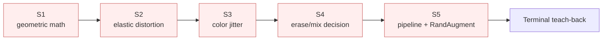

# Leaffliction augmentation — learning map

## Goal & task

- **Goal**: master image-based data augmentation; understand geometric foundations and select techniques that fit the Leaffliction dataset given EDA findings.
- **Task**: complete `src/augmentation/` — add `apply_distortion`, `apply_color_jitter`, decide on erasure/mixing strategy, and design an augmentation pipeline that respects EDA constraints.

## EDA constraints (from issue #4)

| Finding | Implication for augmentation |
|---|---|
| A4: 6× imbalance (1640 vs 275) | Use augmentation as minority-class oversampler |
| B1 = YES: color is main signal | Color jitter bounds must be **tight** (hue tightest) |
| B2 = NO: shape not main | Geometric augmentation is **safe** to use freely |
| B3 = NO local; features scattered ~10% | Large erasure (Cutout) **risks destroying signal** |
| B4/B5/B6 = NO variance | Augment to cover test-time generalization gaps |
| C2: duplicates exist | Out of scope (dedup separately) |

## Stages

### S1 — Geometric foundations (math)
- **Stage goal**: explain affine 2×3 vs perspective 3×3 matrices, and for each existing transform (flip/rotate/skew/shear/crop) state what geometric property is preserved.
- **Acceptance**: name preserved property (parallelism / length / angle / straight-line) per transform; justify why rotation needs 2×3 while perspective needs 3×3.
- **Withhold tag**: concept — user writes pseudocode; reads against `src/augmentation/geometric.py`.

### S2 — Non-linear distortion (radial / lens-like)
- **Stage goal**: implement `apply_distortion` using a **radial distortion model** (lens-like barrel/pincushion) via `cv2.remap`. Elastic deformation (Simard 2003) was studied in theory but user elected radial for the actual implementation.
- **Acceptance**: leaf doesn't tear or escape the frame; explain how the displacement scales with distance from the distortion center; pick a `strength` magnitude that produces visible but non-destructive warp.
- **Withhold tag**: implementation — user writes code with escalating hints (no finished artifact).
- **Theory retained from elastic study** (still useful glossary): `cv2.remap` mechanics, identity remap, per-pixel displacement maps, displacement smoothness vs magnitude trade-off.

### S3 — Photometric / color jitter (Leaffliction-fit)
- **Stage goal**: implement `apply_color_jitter` (brightness / contrast / saturation / hue) with EDA-aware bounds.
- **Acceptance**: per-parameter bound justification; hue range must be tightest (because B1: color = signal); a "rust" leaf must still look like rust after augmentation.
- **Withhold tag**: theory + implementation — user writes bounds reasoning, then code.

### S4 — Local erasure & mixing (decision-only)
- **Stage goal**: read Cutout / Random Erasing / MixUp / CutMix; produce a decision matrix referencing B3 (scattered features) and B6 (no occlusion).
- **Acceptance**: per technique, "adopt / reject + one-line reason"; no code.
- **Withhold tag**: judgment — user writes decision matrix.

### S5 — Pipeline, class imbalance & RandAugment
- **Stage goal**: design augmentation pipeline — train-only, composition order, minority-class oversampling for 6× imbalance, and RandAugment as an alternative to the hand-crafted policy.
- **Acceptance**: pseudocode pipeline with rationale for (1) train-vs-val asymmetry, (2) oversampling multiplier formula, (3) when hand-crafted beats RandAugment and vice versa.
- **Withhold tag**: design — user writes pseudocode.

### Terminal heavy B
Connect S1 → S5 end-to-end in user's own words / cross-stage pseudocode: "why this combined policy fits Leaffliction".

## Glossary

| Term | Plain meaning |
|---|---|
| homogeneous coordinates | Pad `(x, y)` → `(x, y, 1)` so translation can be expressed as matrix multiplication (otherwise it'd be addition). |
| perspective division | After `(x, y, 1) · M_persp = (x', y', w')`, divide both `x'` and `y'` by the **same** `w'` to get 2D screen coords. The "perspective" effect lives in this division. |
| affine vs perspective | Affine: bottom row implicitly `[0, 0, 1]`, so `w'=1` always (no division). Perspective: bottom row can be anything, so `w'` varies per point → parallel lines can converge. |
| vanishing point | Where parallel lines in the world appear to meet in the image (e.g. railroad tracks at the horizon). Only perspective can produce this; affine cannot. |
| preservation hierarchy | `rigid ⊂ similarity ⊂ affine ⊂ perspective`. Each level sacrifices one property: rigid keeps everything → similarity loses distance → affine loses angle → perspective loses parallelism. Straight lines survive all four. |
| camera_like skew | Use perspective (3×3) on a trapezoidal `dst_pts` to simulate non-top-down camera angles — augments EDA B4 weakness (training set is all top-down). |
| cv2.remap | Inverse-mapping function: `output[i, j] = input[map_y[i, j], map_x[i, j]]`. Each output pixel independently picks which input pixel to copy. |
| identity remap | `map_x[i, j] = j` and `map_y[i, j] = i`. Equivalent to "no change". |
| displacement field (dx, dy) | Added to identity grid: `map_x = j_grid + α·dx`. Each pixel offsets independently → non-linear warp. |
| elastic distortion (Simard 2003) | Random (dx, dy) → Gaussian-smooth → multiply by α → remap. Smoothing makes neighbours move together so local structure survives. |
| α (alpha) — elastic | Displacement magnitude. Large = warp more. |
| σ (sigma) — elastic | Gaussian kernel radius. Large = smooth wave; small = jagged noise. |
| safe elastic range | "σ large + α small" preserves color regions (σ keeps neighbours together = color signal intact) and avoids over-warping (α keeps shape near in-distribution). |
| radial distortion | Lens-like warp via `r²/r_max²` × k. `k > 0` shrinks toward center (corners white); `k < 0` bulges outward. Center fixed → leaves stay centered (matches Leaffliction). |
| r_max² normalization | Divide r² by `cx² + cy²` (corner radius²) so `r²_norm ∈ [0, 1]`. Lets `k` keep the same physical meaning across image resolutions. |

## Per-stage gap list

### S1 gaps
1. **Why 2×3 vs 3×3 matrices** — resolved via homogeneous coords + perspective division. ✅
2. **Vanishing-point intuition** — resolved via railroad-track example; affine keeps parallel, perspective doesn't. ✅
3. **Preservation hierarchy across 5 transforms** — resolved via "what does a square become?" heuristic. ✅

### Per-transform preservation table (S1 reference)

| Function | Square → | Straight | Parallel | Angle | Distance | Class |
|---|---|:-:|:-:|:-:|:-:|---|
| flip | square | ✅ | ✅ | ✅ | ✅ | rigid |
| rotate | square | ✅ | ✅ | ✅ | ✅ | rigid |
| crop+resize | scaled square | ✅ | ✅ | ✅ | ❌ | similarity |
| shear | parallelogram | ✅ | ✅ | ❌ | ❌ | affine |
| skew (perspective) | trapezoid | ✅ | ❌ | ❌ | ❌ | perspective |

### Why every geometric augmentation is safe for Leaffliction (EDA cross-check)

The blanket statement "geometric augmentation is safe" rests on a single structural fact:

> **Geometric transforms only rearrange pixel positions. They do not change pixel color values.**

Combine that with the EDA findings:

| EDA finding | What it means for geometric augmentation |
|---|---|
| **B1 = YES** (color is the main classification signal) | Geometric transforms **never touch color** → the disease signal is preserved by construction. |
| **B2 = NO** (shape/contour is NOT the main signal) | Even when geometric transforms distort the leaf's shape (shear → parallelogram, skew → trapezoid), they are not damaging information the classifier relies on. |
| **B3 = NO local** (features scattered ~10% across whole leaf) | `crop(scale=0.8)` only removes the outer border. Because lesions are scattered across the entire leaf, plenty of disease evidence survives the crop. Would be unsafe if features were small + local. |
| **B4 = NO** (training is all top-down) | `rotate`, `skew (camera_like)`, `shear` actively **fill a gap** — they simulate the off-axis test-time photos the model would otherwise have never seen. Net positive. |
| **C1 = YES** (consistent 256×256 resolution) | `crop+resize` keeps input shape consistent for the model. |

**Per-function risk audit:**

- `apply_flip` — horizontal mirror; top-down leaves have no canonical left/right → fully safe.
- `apply_rotate` — leaves have no canonical orientation when photographed top-down → fully safe.
- `apply_shear` — distorts shape only (B2 not signal); use mild magnitudes to avoid unrecognizable leaves.
- `apply_skew (camera_like)` — the **most useful** geometric augmentation here, because it directly augments B4 (top-down-only training).
- `apply_crop + resize` — safe under B3 (scattered features); would be **unsafe** in a dataset where lesions were tiny and localized (B3 = YES), since cropping could remove the only diagnostic region.

**One-line summary**: geometric augmentation is safe here because the **signal (color) lives in a dimension geometric transforms don't touch**, and the **shape distortion they cause sits in a dimension the model shouldn't rely on (B2 = NO)**.

### S2 gaps
1. **Why matrices can't express per-pixel displacement** — 2×3/3×3 has 6–8 DOF; 256×256 image needs 131k DOF. Resolved via degrees-of-freedom argument. ✅
2. **`cv2.remap` mechanics** — inverse mapping `output[i,j] = input[map_y[i,j], map_x[i,j]]`. Resolved via 3×3 toy walkthrough. ✅
3. **Identity → displacement field** — `map_x[i,j]=j, map_y[i,j]=i` + per-pixel offset. Resolved. ✅
4. **Elastic distortion theory (Simard 2003)** — α (magnitude) vs σ (smoothness); audio analogy clarified the confusion. Studied as theory; not implemented. ✅
5. **Radial distortion mechanics** — center + `r²/r_max²` × k. Implemented in `apply_radial_distortion`. ✅
6. **`r_max²` normalization rationale** — keep `k` resolution-independent. ✅

### S3 gaps
_(pending)_

### S4 gaps
_(pending)_

### S5 gaps
_(pending)_

## Mastery state

States: `unknown → reading → implemented → explained` (reversible — failure demotes).

| Stage | Gap | State |
|---|---|---|
| S1 | affine vs perspective math | explained |
| S1 | preservation hierarchy | explained |
| S2 | matrices can't do per-pixel | explained |
| S2 | cv2.remap mechanics | explained |
| S2 | elastic distortion (Simard 2003) | explained (theory only) |
| S2 | radial distortion + implementation | explained |
| S3 | (pending) | unknown |
| S4 | (pending) | unknown |
| S5 | (pending) | unknown |

## Teach-back records

### S1 light teach-back (2026-06-09)
- **Why probe** — "preserve angle but not distance" → user answered `affine`. Acceptable; more precise term is `similarity transform` (a subset of affine). Demonstrates correct grasp of hierarchy.
- **What-if probe** — "affine + trapezoid `dst_pts`" → user answered "做不到，會變平行四邊形". Correct. Shows internalized understanding that affine cannot break parallelism.

## Map

**Legend**: 🔴 unknown · 🟡 reading · 🟢 implemented · ✅ explained
