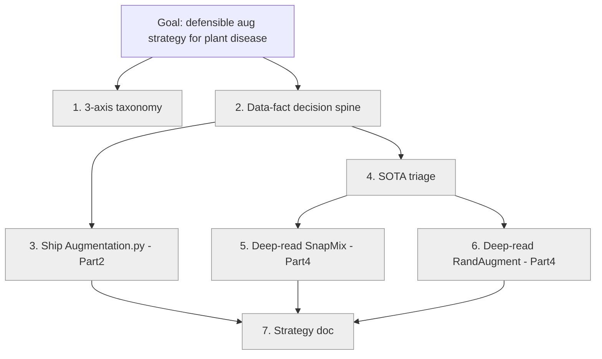

# Learning Map — Leaffliction: Augmentation Strategy for Plant Disease Detection
# 學習地圖 — Leaffliction:植物病害偵測的資料增強策略

> Bilingual doc (EN / 中文). 雙語文件,英文在前、中文在後。

## Goal / 學習目標 (refined via grill-me, 2026-06-06)

**EN.** Be able to **design and defend a layered data-augmentation strategy for a
plant disease detection dataset**, grounded in the dataset's actual
characteristics — not just recite traditional transforms. Cover per-sample
geometric/color/erasing, the policy layer (RandAugment family), batch-level
label-mixing (CutMix/SnapMix), and generative synthesis — and for each, argue
**mechanism, applicability, and risk to labels/distribution**, including **why NOT
to use** a method here.

**中文.** 能**為一個植物病害偵測資料集,根據其真實資料特性,設計並辯護一套分層的資料增強策略**
——而不是只會背傳統手法。涵蓋 per-sample 的幾何/色彩/抹除、策略層(RandAugment 家族)、
batch 層的標籤混合(CutMix/SnapMix)、以及生成式合成;每個方法都要能論證**機制、適用條件、
以及對標籤/分佈的風險**,包含**為什麼在這裡不該用**某方法。

**One-line ability / 一句話能力:** "Given a plant-disease dataset, I can derive an
augmentation policy from its data facts, justify every include/exclude against the
literature, and read any new augmentation paper to triage its relevance."
／「給我一個植物病害資料集,我能從資料事實推導出增強策略、用文獻佐證每個取捨、並讀懂任何新的
增強論文來判斷它適不適用。」

## Acceptance / 驗收標準 (primary + co-equal)

- **(a) PRIMARY / 主驗收 — a defensible strategy document / 一份可辯護的策略文件** (rubric below / 見下方 rubric).
- **(b) CO-EQUAL / 並列 — paper-reading literacy / 讀論文素養**: read a primary paper,
  decode its math, restate the mechanism as pseudo-code.
  讀原始論文、解開它的數學符號、用 pseudo-code 重述機制 → 逼出真正的原始來源閱讀,而非二手摘要。
- Deliberately NOT the goal / 刻意不是目標: (c) implementation handsiness 程式手感,
  (d) measured accuracy gains 準確率數字. (Augmentation.py is only the Part-2 anchor.)

## Goal decision log / 目標決策日誌 (grill-me convergence)

- **Q1 acceptance / 驗收** → (a) strategy doc PRIMARY + (b) paper literacy CO-EQUAL.
  (a) 策略文件為主 + (b) 讀論文素養並列。
- **Q2 deep-read selection axis / 深讀選擇軸** → **X = decision-relevance 決策相關性**
  (not pedagogy-for-its-own-sake). Consequence: strategy-doc spine is data-driven.
  後果:策略文件的脊椎是資料導向,不是方法導向。
- **Q3 strategy-doc structure / 策略文件結構** → **D = data-driven decision tree 資料導向決策樹** + 6-pt rubric.
- **Q4 SOTA horizon / 最新方法掃描** → **triage, not tourism 分流而非觀光**: fixed candidate
  list, each gets a one-paragraph verdict (helpful / not / conditional) traced to a
  data fact, via the fine-grained / localized-lesion / color-cue lens.
  固定候選清單,每個一段判決(有用/沒用/有條件)+ 回溯資料事實,用「細粒度/局部病斑/顏色線索」鏡片。
- **Q5 deep-read picks / 深讀名單** → **config α: SnapMix + RandAugment** (exactly 2, beyond
  traditional transforms 傳統轉換之外恰好 2 個). Leverage / 槓桿: SnapMix drags in
  CutMix+Mixup as baselines; RandAugment drags in AutoAugment+TrivialAugment lineage
  → ~6 methods understood via 2 deep reads. 一篇帶基線,2 篇實質懂 6 法。
  Triage rejects / 分流拒絕: generative (A3 smallest=275, not scarce 最小 275 非極少),
  vanilla Mixup (global blend harms color cue B1 全域混色傷顏色線索); Random Erasing =
  conditional (B6 occlusion=NO weakens rationale 遮擋=NO 削弱理由).
  **Accepted consequence / 接受的後果:** the shipped Augmentation.py uses only
  traditional + bounded color (already known); the deep learning lives in the
  strategy doc + the two papers + Part 4. 交付的程式只用已會的傳統+有界色彩,深學落在策略文件、
  兩篇論文與 Part 4。

## Strategy-doc rubric / 策略文件評分表 (pass = all 6 checked / 6 條全勾才及格)

1. Every method decision traces to ≥1 concrete data fact (cite Issue #4 Ax/Bx/Cx).
   每個方法決策都回溯到 ≥1 條具體資料事實(引用 Issue #4 的 Ax/Bx/Cx 編號)。
2. ≥2 explicit **reject** decisions with reasons (e.g. generative, Mixup).
   ≥2 個明確的**拒絕**決策且說得出理由(如生成式、Mixup)。
3. Every method tagged on the 3 axes — proves no method mis-placed (CutMix ≠ Augmentation.py).
   每個方法標注三軸坐標 — 證明沒放錯位(CutMix 不能塞進 Augmentation.py)。
4. Each deep-read paper (SnapMix, RandAugment) restated as own-words pseudo-code.
   兩篇深讀(SnapMix、RandAugment)各能用自己的話寫出核心機制 pseudo-code。(同時滿足驗收 (b))
5. ≥1 data risk's effect on augmentation named (e.g. C2 dup pairs → dedup? B5 shadow → simulate?).
   指出 ≥1 個資料風險如何影響增強(如 C2 重複圖 → 要不要去重?B5 過曝陰影 → 要不要模擬?)。
6. Explicit Part-2 (→ Augmentation.py) vs Part-4 (→ train.py) split.
   明確切分 Part 2(→ Augmentation.py)與 Part 4(→ train.py)。

## The 3-axis taxonomy / 三軸分類學 (organizing frame / 組織框架)

| Axis / 軸 | One end / 一端 | Other end / 另一端 |
|------|---------|-----------|
| unit 作用單位 | per-sample (1→1) 單張 | batch (mix ≥2) 多張混合 |
| label 標籤 | label-preserving 標籤不變 | label-mixing (soft) 標籤混合(軟標籤) |
| timing 時機 | offline (savable) 可存檔 | online (dataloader only) 僅訓練期 |

Placement of the families / 各方法家族定位:

| Method 方法 | unit | label | savable? 可存檔 | Part |
|--------|------|-------|----------|------|
| geometric 幾何 (flip/rotate/shear/skew/crop) | per-sample | preserving | ✅ | 2 |
| color bounded 有界色彩 | per-sample | preserving | ✅ | 2 |
| Random Erasing/Cutout 抹除 | per-sample | preserving | ✅ | 2 (conditional 有條件) |
| RandAugment | per-sample policy 策略 | preserving | ⚠️ both | 4 (deep-read 深讀) |
| Mixup | batch(2) | mixing | ❌ | 4 (reject 拒絕) |
| CutMix | batch(2) | mixing | ❌ | 4 (baseline 基線) |
| SnapMix | batch(2) | mixing (CAM-weighted CAM加權) | ❌ | 4 (deep-read 深讀) |
| generative 生成式 (GAN/diffusion) | synthesis 合成 | assigned | ⚠️ | 4 (reject 拒絕) |

## Withhold contract / withhold 契約 (what the learner must produce / 學習者必須產出什麼)

- **EN.** Learner writes pseudo-code of the core mechanism + the strategy decisions.
  Mentor supplies runnable plumbing & sources; on deep-reads, decodes the paper
  section-by-section but the pseudo-code restatement is the learner's. Augmentation.py
  is NOT the learning target → mentor may scaffold it generously.
- **中文.** 學習者寫「變換機制的 pseudo-code」+「策略決策」。導師提供可跑的 plumbing 與來源;
  深讀時導師逐段解論文,但 pseudo-code 重述由學習者完成。Augmentation.py 不是學習重點 → 導師可大方搭骨架。
- Stack 技術棧: **cv2 + numpy** (team-consistent w/ Transformation; exposes the matrix
  與 Transformation 一致、且把矩陣攤開), display via **matplotlib**. No plantcv/pandas/altair/tqdm.

## Team context / 團隊脈絡 (git + GitHub, surveyed 2026-06-06)

- Repo `Recursive-Descenders/Leaffliction`. `main` = integration (Distribution +
  Image-analysis merged). `mzolfagh/Transformation` = PR #2 OPEN (cv2 + plantcv).
  主分支已併入 Distribution + Image-analysis;Transformation 為 PR #2 開發中。
- CLI convention 慣例: thin `src/Augmentation.py` → `typer.run(run)`; logic in
  `src/augmentation/`; output `outputs/augmentation/`; flake8.
- pyproject gotcha 坑: `packages.find include = ["distribution*"]` must add
  `"augmentation*"` or `uv run aug` won't import. 否則 `uv run aug` 匯入失敗。
- **Issue #4** (data analysis, answered / 資料分析,已回覆): ~6x imbalance
  (apple_healthy 1640 vs apple_rust 275; smallest 275 → NOT scarce 非極少).
  B1 color = main disease cue 顏色為病徵主因 → color shifts RISKY 色彩偏移有風險.
  B2 shape NO 形狀非主因, B3 lesion scattered ~10% 病斑散佈, B4 top-down 俯視,
  B5 lighting low-variation 光照變化小, B6 occlusion NO 無遮擋, C1 all 256x256,
  C2 7 dup pairs 7 組重複圖.
- **Issue #1** (OPEN, unresolved / 未解): balancing semantics + augmented_directory
  return → affects Augmentation.py output behavior. 影響程式輸出行為,待團隊決定.

## Stage decomposition / 階段拆解

| # | Stage goal / 階段目標 | Acceptance / 驗收 | Withhold | Part |
|---|-----------|-----------|----------|------|
| 1 | 3-axis taxonomy: place any method 三軸分類學:能定位任意方法 | Place all 8 families correctly 8 個都放對 | learner places | frame |
| 2 | Data-fact → decision spine 資料事實→決策脊椎 | Decision-tree skeleton; geometric accept, color bounded, rejects 決策樹骨架 | learner argues | doc |
| 3 | Ship Augmentation.py: traditional + bounded color 交付程式 | Runs per subject, no crash, flake8 | mentor may scaffold | 2 |
| 4 | SOTA triage 最新方法分流 | Triage table; ≥2 rejects justified 分流表 | learner verdicts | doc |
| 5 | Deep-read SnapMix (CutMix+Mixup baselines) 深讀 SnapMix | Pseudo-code of CAM-weighted label mix; why > CutMix | learner pseudo-code | 4 |
| 6 | Deep-read RandAugment (AutoAugment→TrivialAugment) 深讀 RandAugment | Pseudo-code of policy; N/M search-space | learner pseudo-code | 4 |
| 7 | Synthesize strategy doc 綜合成策略文件 | All 6 rubric checks pass 6 條全勾 | learner writes | both |

## Per-stage gap lists & sources / 各階段缺口與來源
_(filled as we enter each stage / 進入各階段時填寫)_

## Glossary / 詞彙表

| Term 術語 | Plain meaning / 白話 |
|------|---------------|
| augmentation 資料增強 | Make new training images by transforming existing ones 透過變換既有圖製造新訓練圖 |
| class imbalance 類別不平衡 | Some classes have far more images (~6x) → model biased to majority 某些類別多很多 → 模型偏向多數 |
| fine-grained classification 細粒度分類 | Classes differ only subtly (Early vs Late Blight) → cue is small/local 類別差異極小 → 線索小而局部 |
| label-preserving 標籤保持 | Transform keeps the original label valid 變換後原標籤仍正確 |
| label-mixing 標籤混合 | Blend 2 images AND their labels into a soft label 混兩張圖與其標籤成軟標籤 |
| affine transform 仿射變換 | rotate/scale/shear + translation; cv2 2x3 matrix M 旋轉/縮放/剪切+平移,cv2 的 2×3 矩陣 |
| warpAffine | cv2: per output pixel, use M to find source pixel 每個輸出像素用 M 找回源像素 |
| displacement field 位移場 | per-pixel (dx,dy) offsets; basis of elastic distortion 每像素位移,彈性扭曲的基礎 |
| Mixup | mix two images by convex combo λ; label = λ-weighted 凸組合混兩圖,標籤按 λ 加權 |
| CutMix | paste a patch of B into A; label weighted by patch area 把 B 的方塊貼進 A,標籤按面積加權 |
| SnapMix | CutMix using CAM to weight the soft label by real discriminative content, for fine-grained 用 CAM 按真實判別內容加權標籤,專為細粒度 |
| CAM | class activation map: where the network looks to decide a class 類別活化圖:網路看哪裡做判斷 |
| RandAugment | pick N random ops at magnitude M from a fixed set 從固定集隨機選 N 個操作、強度 M |
| AutoAugment | learn an aug policy by search (expensive) 用搜尋學增強策略(昂貴) |
| TrivialAugment | parameter-free: one random op, random magnitude 零參數:一個隨機操作、隨機強度 |
| triage 分流 | quick relevance verdict: helpful / not / conditional + why 快速判決:有用/沒用/有條件+理由 |

## Mastery state / 精熟狀態
Legend / 圖例: `unknown → reading → implemented → explained` (reversible 可逆)

| Stage | Gap | State |
|-------|-----|-------|
| 1 | 3-axis-taxonomy | unknown (drafted in doc; needs learner teach-back 已草擬,待 teach-back) |
| 2 | data→decision spine | unknown |
| 3 | augmentation.py | unknown |
| 4 | sota-triage | unknown |
| 5 | snapmix | unknown |
| 6 | randaugment | unknown |
| 7 | strategy-doc | unknown |
| (3) | flip-rotate basics | learner-claimed known; verify on entry 學習者自稱已會,進入時驗證 |

## Map / 地圖

