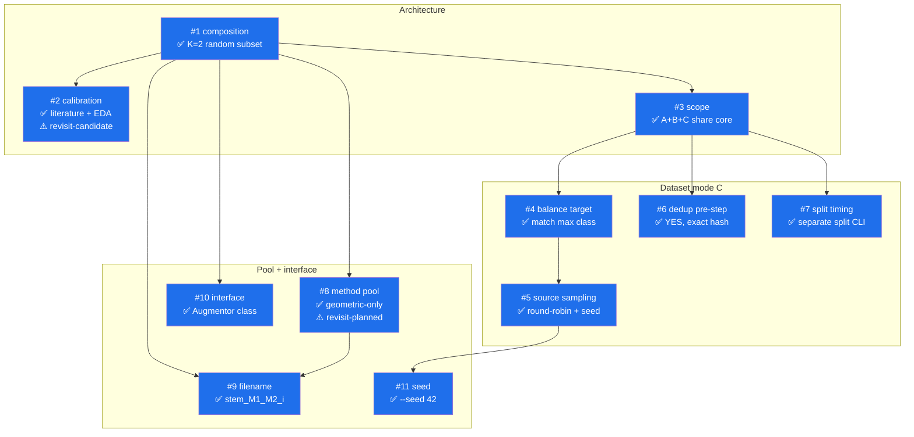

# Spec — Augmentor Pipeline

**Converged from**: [decision-graph.md](decision-graph.md) (11 nodes, all resolved).
**Date**: 2026-06-09
**Context**: Leaffliction (42 RNCP). EDA findings from issue #4 (6× class imbalance, B1 color = signal, B2 shape not signal, B3 features scattered, B4 top-down only, C2 known duplicates).

---

## ⚠️ Unresolved Premises

Two adopted decisions carry **planned re-assumption flags** — they ship as MVP defaults but the upgrade path is already mapped.

| Node | Flag | Trigger to revisit | Upgrade path |
|---|---|---|---|
| **#2 Calibration** | revisit-candidate | Model training reveals overfit / underfit tied to augmentation magnitudes | `d` (literature + EDA heuristic) → `e` (add K=2 sampled human stress test on hue / saturation / erasure axes) |
| **#8 Method pool** | revisit-planned | When S3 (`apply_color_jitter`) ships | `A` (geometric-only, 6 methods) → `B` (append `color_jitter`, pool grows to 7) |

Neither blocks MVP shipping; both are tracked openly so the team knows where the seams are.

---

## Adopted Decisions (in dependency order)

### Architecture core

#### #1 — Composition strategy: K=2 random subset (RandAugment-lite)
Each output image = 2 transforms drawn at random from the pool, each applied at its calibrated safe magnitude.
- Rejected `a` (1 transform per output) — no exposure to compound real-world conditions.
- Rejected `c` (stack all N) — B1 color signal cannot survive 6-layer compounding.
- Rejected `d` (mixed counts) — complexity without clear win.

#### #2 — Calibration strategy: literature + EDA heuristic ⚠️ revisit-candidate
Take RandAugment / Albumentations defaults; tighten per EDA group:
- High freedom (B2 shape not signal): `flip / rotate / shear / skew / crop` → literature defaults.
- Low freedom (B1 color = signal): `hue / saturation` → tightest end (post-S3 ship).
- Forbidden (B3 features scattered): large-area erasure rejected outright.

Rejected: `a` manual-only (slow, subjective), `b` full K=2 stress test (O(N²) overkill pre-training), `c` classifier-feedback (chicken-and-egg + bias risk), `e` recommended hybrid (deferred for MVP simplicity).

#### #3 — Scope: A+B+C share one K=2 core
Three CLI entry points wrap the same `Augmentor.apply(image)` core:
- **A** `aug image.jpg --n 5` — single image, 5 K=2 outputs (replaces subject Part 2 fixed-6-output behavior).
- **B** `aug-class apple_rust/ --target 1640` — single class folder fill-to-target.
- **C** `aug-dataset data/train/ --balance` — dataset root, balance all classes to max.

Rejected: A-only / B-only / C-only — each kills another mode's use case.

### Dataset-level decisions (mode C)

#### #4 — Balance target: match max class count
`target = max(class_counts)`. Minorities augmented up; majority untouched.
- `apple_rust` needs `1640 - 275 = 1365` synthetic copies from 275 sources → ~5× synthetic-to-real ratio.
- Rejected `b` configurable N (requires throwing real data when N < max), `c` per-class multiplier (doesn't fix relative imbalance), `d` opt-in majority augmentation (no clear benefit, complicates baseline).

#### #5 — Source sampling: round-robin + seeded RNG
Deterministic floor + remainder: `floor(need / N_sources)` per source, first `need % N_sources` sources produce one extra.
- Rejected `α` random-with-replacement (variance leaves some sources unused), `γ` shuffle cycles (no value over β), `δ` stratified by attribute (no attribute labels).

#### #6 — Dedup pre-step: YES (exact file-hash)
SHA-256 / MD5 byte-hash dedup runs before any pipeline stage. EDA C2 found 7 pairs in `apple_healthy/`; without dedup their augmented copies inherit duplicate weight.
- Sub-detail `#6b` (perceptual / near-dup hash) deferred — reopen if exact-hash misses real near-dups.

#### #7 — Train/val split timing: separate `split` CLI
Pipeline composition: `split data/raw/Apple/ --val 0.2` → `data/train/`, `data/val/`; then `aug-dataset data/train/ --balance` only augments train.
- Rejected `I` augment-then-split (DATA LEAK risk), `II` monolithic (couples concerns), `III` augmentor-handles-split-internally (re-splits on every run, breaks val-set stability across experiments).
- Sub-detail: split is stratified per-class (ML common sense default, not grilled).

### Pool and interface details

#### #8 — Method pool: geometric-only (MVP) ⚠️ revisit-planned
`POOL = [flip, rotate, shear, skew, crop, radial_distortion]`. Ships now to unblock Part 4 teammates. `K=2` combinations = `C(6,2) = 15`.
- Rejected `B` (6 + color_jitter) — blocked on S3; queued as upgrade.
- Rejected `C` (6 + color_jitter + erasure) — erasure unsafe under B3 (scattered features).
- Rejected `D` (configurable pool flag) — over-engineered.

#### #9 — Output filename: `<stem>_<Method1>_<Method2>_<i>.<ext>`
Records the two methods in call-order + per-source index.
- Example: `apple_rust_001_Rotate_Shear_0.jpg`.
- Rejected index-only `<stem>_aug_<i>` (harder to debug) and subject `<stem>_<Method>` (only fits K=1).

#### #10 — Interface: class-based `Augmentor`
`Augmentor(pool, seed).apply(image) → image`. Holds RNG + pool + magnitude ranges.
- Rejected pure functional API (param-heavy at call sites).

#### #11 — Seed: CLI `--seed 42` default
Default seeded for reproducible MVP runs; `None` opts into stochastic.

---

## Implementation Skeleton

Recommended directory layout (matches existing `src/augmentation/` structure):

```
src/augmentation/
  __init__.py
  core.py              # Augmentor class (#10) — pool + seeded RNG + K=2 apply (#1)
  registry.py          # POOL list of Method dataclasses (#8) — magnitudes from #2
  methods/
    geometric.py       # existing 6 methods (flip / rotate / shear / skew / crop / radial_distortion)
    photometric.py     # future home for color_jitter (S3 → triggers #8 revisit-planned)
  cli/
    single.py          # mode A entry: aug image.jpg --n 5 --seed 42        (#3 + #11)
    class_dir.py       # mode B entry: aug-class apple_rust/ --target 1640   (#3)
    dataset.py         # mode C entry: aug-dataset data/train/ --balance     (#3 + #4)
    split.py           # mode IV split entry: split data/raw/Apple/ --val 0.2 (#7)
  preprocess/
    dedup.py           # exact file-hash dedup (#6)
  io.py                # filename builder: <stem>_<Method1>_<Method2>_<i>.<ext> (#9)
```

### Mode C control flow

```
1. (Optional pre-step) dedup data/train/                              [#6]
2. For each class folder in data/train/:                              [#3 mode C]
     count = len(images)
     need  = max_class_count - count                                  [#4]
     if need <= 0: continue
     per_source = need // count
     remainder  = need % count
     for i, source in enumerate(sorted(images)):                      [#5 round-robin]
         copies = per_source + (1 if i < remainder else 0)
         for k in range(copies):
             image = load(source)
             augmented = augmentor.apply(image)                       [#1 + #10]
             # augmentor internally picks K=2 methods from POOL, applies
             # each at a random magnitude within its calibrated range  [#2 + #8]
             out_name = build_name(source, augmentor.last_methods, k) [#9]
             save(augmented, class_folder / out_name)
```

---

## Final Panorama



---

## Handoff

The spec is ready to flow downstream:

- **`/to-issues`** — break this spec into independently-grabbable issues for teammates (recommended for ship-MVP-fast).
- **`/to-prd`** — promote to a single PRD if you want a higher-level document for stakeholder alignment.
